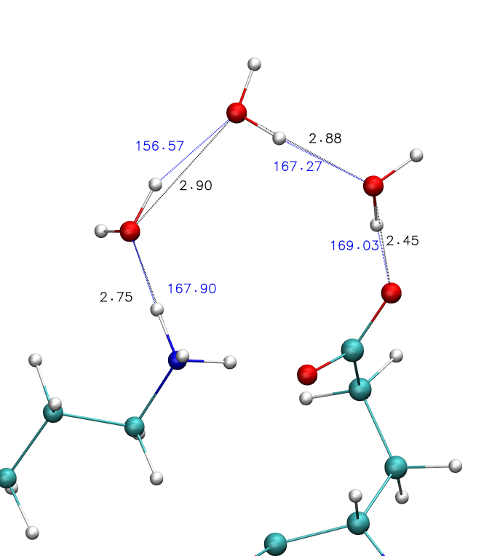

# Käyttöohje

Käytetään biofysikaalisten tietokonesimulaatioiden trajektoreiden analysoimiseen.

Ohjelma löytää lyhimmän polun kahden valitun atomin välillä
(mikäli sellainen on olemassa). Alla esimerkki löydetystä polusta.

Polku muodostuu vetysidoksista.
Vetysidoksen määritelmää voi muuttaa (etäisyys ja kulma).

## Ohjelman ajaminen
Ohjelma suoritetaan komentoriviltä.
Yksinkertaisimmillaan `./pathfinder.out` ja ohjelma itse kertoo mitä argumentteja tarvitsee.

Argumentteja on kuusi erilaista:

-pdb määrittää käytettävän [pdb](https://www.cgl.ucsf.edu/chimera/docs/UsersGuide/tutorials/pdbintro.html) tiedoston
-xtc määrittää käytettävän [xtc](http://manual.gromacs.org/online/xtc.html) tiedoston

Edellämainittujen kohdalla on tärkeää, että kyseessä on sama rakenne
(esimerkiksi pdb tiedosto toimii simulaation lähtötilanteena
ja xtc tiedosto on syntyvä trajektori).

-par määrittää käytettävän parametri -tiedoston.
Kyseinen formaatti on tätä ohjelmaa varten kehitetty.
Lisää tästä myöhemmin.

-start määrittää lähtö atomin indeksin (verrattaessa pdb tiedoston indeksöintiin tähän pitää antaa `indeksi-1` arvo).
-end määrittää kohde atomin indeksin.
-limiter määrittää alueen minkä sisältä polkua etsitään (nopeuttaa etsimistä).

Limiter argumentti on ainut vapaaehtoinen.
Pdb, xtc ja parametri tiedostojen nimet tarvitaan vain kertaalleen
(jos niitä antaa useampia niin myöhemmin tulevat jäävät voimaan)
mutta start, end ja limiter komentoja voi antaa myös useampia kerralla
ja ne luetaan vasemmalta oikealle (jokaisella kierroksella).

Esimerkki komento:
`./pathfinder.out -pdb structure.pdb -xtc trajectory.xtc -par parameters.txt -limiter 12.0 -start 500 -end 550`

### Parametrien formaatti
Parametri -tiedostossa voi olla seisemänlaisia komentoja.
Kukin komento alkaa 4-kirjaimisella avainsanalla.
Isot ja pienet kirjaimet tulkitaan eri kirjaimina.

Avainsanoja ovat:
-ANGL määrittää vetysidoksessa käytettävän kulman (asteissa)
-DIST määrittää vetysidoksessa käytettävän etäisyyden (xtc tiedosto on nanometreissä, joten tämä on samassa yksikössä)
-DCMP määrittää aluejaon kolmessa suunnassa

-NDEF määrittää tiedostossa olevien solmu -määritelmien lukumäärän

-NHYD aloittaa solmun määritelmän kertomalla solmuun kuuluvien vetyatomien lukumäärän
-RESI määrittää mistä residue:sta (yksikkö) kyseinen solmu löytyy (määritelmä voi olla lavea tai tarkka)
-ATOM määrittää mistä atomista on kyse ja onko kyseessä vety- vai ei-vety -atomi.

#### ANGL kulma
Annetaan liukulukuna, esimerkiksi:
`ANGL 20.0`
Tällöin kulmaksi tulee 20 astetta.

#### DIST etäisyys
Annetaan liukulukuna, esimerkiksi:
`DIST 0.3`
Tällöin etäisyydeksi tulee 0.3nm (riippuu xtc -tiedoston etäisyysyksiköstä).

#### DCMP aluejako
Annetaan kolmena kokonaislukuna, esimerkiksi:
`DCMP 70 70 70`
Tällöin alue on jaettu 70 osaan kaikissa simulaatiolaatikon suunnissa.

#### NDEF määritelmien lukumäärä
Annetaan yhtenä kokonaislukuna, esimerkiksi:
`NDEF 3`
Tällöin ohjelma odottaa tiedoston sisältävän määritelmät kolmelle erilaiselle solmulle.

#### NHYD vety-atomien lukumäärä
Annetan yhtenä kokonaislukuna, esimerkiksi:
`NHYD 2`
Tällöin ohjelma odottaa, että kyseinen määritelmä sisältää yhden RESI -komennon,
yhden ei-vety ATOM -komennon ja kaksi vety ATOM -komentoa.
Lyhyesti sanottuna siis kyseisen määritelmän mukaiset solmut sisältävät kaksi vety-atomia.

#### RESI residue:n määritelmä
Annetaan, joko muodossa kokonailuku residue:n nimi, esimerkiksi:
(1) `RESI 0 ARG`
tai edelliseten lisäksi myös segmentti nimi (ks. pdb formaatti myöhemmin), esimerkiksi:
(2) `RESI 0 ARG PROA`
tai kolmantena vaihtoehtona edellisten lisäksi myös residue:n indeksi, esimerkiksi:
(3) `RESI 0 ARG PROA 33`.

Kaikissa oleva ensimmäinen kokonaisluku määrittelee sen,
että voiko sama residue sisältää tämän määritelmän jälkeen vielä lisää solmuja.
Jos luku on `0` kuten se on yllä kaikissa ollut,
ohjelma ei löydettyään kyseisen solmun enää etsi samasta residuesta lisää solmuja.
Tämän avulla voi siis vaikuttaa muiden määritelmien toteutumiseen.
Jos luku olisi suurempi kuin `0` niin silloin ohjelma jatkaisi saman residuen lukemista.
Määritelmät luetaan muistiin ylhäältä alas siinä järjestyksessä kuin ne ovat tiedostossa.
Samoin pdb tiedosto luetaan ylhäältä alas järjestyksessä.

#### ATOM atomin nimi ja luokka
Annetaan muodossa luku 1 tai 2 ja atomin nimi (mahdollisesti näiden välissä ei ole väliä), esimerkiksi:
`ATOM 1 GB `
tai esimerkiksi
`ATOM 2 H3 `.
Jos annettu luku on 1 ohjelma tulkitsee kyseisen atomin ei-vety atomina.
Ei-vety atomeja voi olla solmussa vain yksi.
Jos taas luku on 2 niin ohjelma tulkitsee atomin vety-atomina.
Vety-atomeja kuuluu olla solmussa niin paljon kuin `NHYD` komento käskee.

Komento voi myös olla muotoa:
`ATOM 2HE21`
jolloin `2` edessä tarkoittaa vetyä ja `HE21` on atomin nimi.

Tarkemmin atomin nimestä pdb -formaatissa.

### Pdb -tiedostojen formaatti
Ohjelma lukee pdb tiedostoista vain ne rivit, jotka alkavat `ATOM`.
Ohjelma ei lue atomin järjestyslukua, vaan ohjelman sisällä on juokseva numerointi,
joten pdb tiedoston täytyy olla täydellinen (sama määrä atomeja kuin xtc tiedostossa jne).

RESI komento lukee kolmea kohtaa kultakin luettavalta riviltä:
`18-20	Residue name`, `73-76	Segment identifier` ja `23-26	Residue sequence number`.
Numerot viittaavat rivillä oleviin ascii -merkkeihin, ensimmäisen merkin ollessa numero `1`.

ATOM komento lukee vain yhtä kohtaa luettavalta riviltä:
`13-16	Atom name`.

Tarkemmin infoa formaatista on sivulla: [www.cgl.ucsf.edu](https://www.cgl.ucsf.edu/chimera/docs/UsersGuide/tutorials/pdbintro.html)

PDB tiedostoja saa esimerkiksi [RSCB](https://www.rcsb.org/pdb/home/home.do) sivustolta.
Esimerkki systeemi on rakennettu pdb `2DYR` pohjalta [Charmm-GUI:ta](http://www.charmm-gui.org/) käyttämällä,
sekä [VMD:tä](http://www.ks.uiuc.edu/Research/vmd/) ja [PSFGEN:ä](http://www.ks.uiuc.edu/Research/vmd/plugins/psfgen/).

VMD soveltuu hyvin visualisointiin.

### Xtc -tiedostojen tuottaminen
Xtc tiedostot voivat olla isoja, joten niitä ei tässä projektissa jaeta.
Mutta esimerkiksi seuraamalla [GROMACS tutoriaaleja](http://www.bevanlab.biochem.vt.edu/Pages/Personal/justin/gmx-tutorials/)
xtc -tiedostoja saa helposti tuotettua.
Tähän tarvitsee vain [GROMACS](http://www.gromacs.org/) ohjelman jne, jotka kaikki saa ilmaiseksi netistä.

## Ohjelman kääntäminen
Ohjelman kääntäminen on yksinkertaista:
Mene src -kansioon ja kirjoita terminaalissa komento `make`.
Tätä ennen täytyy muokata makefile -tiedostoa, jotta edellä mainittu komento löytää GROMACS funktiot.

Muokkaus on yksinkertaista:
vaihda seuraavien osoitteiden tilalle omaa tietokonettasi vastaavat osoitteet:
`dir2=/opt/gromacs-5.0.7/lib` ja `dir3=/opt/gromacs-5.0.7/include/gromacs/fileio`.
Ensimmäisestä osoitteesta löytyy gromacs -kirjasto ja jälkimmäisestä header -tiedosto.

Jos et tiedä mikä on make -ohjelma niin [README](../README.md) -tiedostosta löytyy lisää ohjeita.