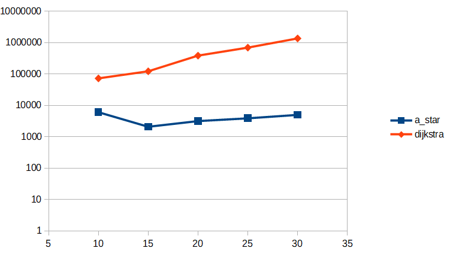
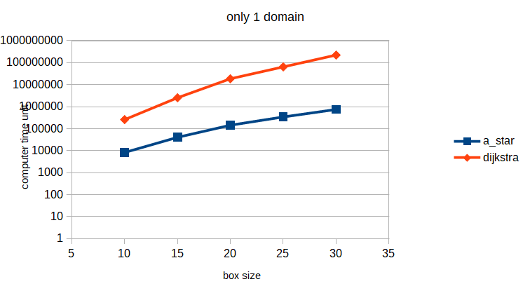
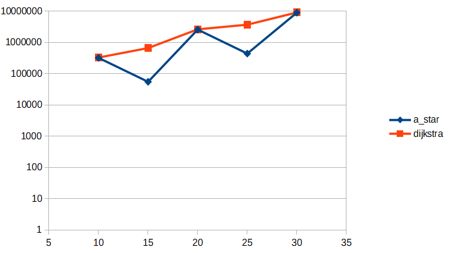
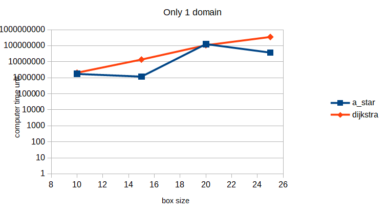

# Testausdokumentti

## Mitä on testattu, miten tämä tehtiin

Unity -C ohjelmointikielen testaus pakettia käyttäen ohjelman tietorakenteita ja algoritmeja on testattu.

Testeissä on testattu olennaisia ja vähemmän olennaisia osia ohjelmasta. Yksi testien hyöty on ollut tietorakenteiden ja algoritmien käyttämisen harjoittelu, mikä on hyödyttänyt ohjelmointia suuresti. Tämän yhtenä piirteenä on ollut ylipäätänsä ohjelman kääntymisen testaaminen. Varsinaisten algoritmien kohdalla myös väärät tulokset on löydetty testien avulla (tulokset jotka eivät tuota segmentation fault:a tai ohjelman muuta keskeytystä).

Myös ohjelman tehokkuutta testattiin suhteessa solmujen määrään ja alueiden (domain) määrään.

### test_graph_implementation.c

Sisältää tällä hetkellä 12 eri testitapausta, joista kukin sisältää useampia "TEST_ASSERT" (ja muita) -testejä.

Esimerkiksi "test_heuristic" testaa, että ohjelma laskee todellisen etäisyyden oikein. "test_vertex_graph" testaa VERTEX ja GRAPH rakenteiden yhteensopivuutta ja yhteistoimintaa. "test_insert_many_vertex_to_graph" oli myös tärkeä testi. "test_periodicity" vastaa "test_heuristic" testiä, mutta periodisten reunaehtojen läsnäollessa.

### test_heap.c

A* -algoritmin järjestämisalgoritmiksi valikoitui kekojärjestäminen. Keolle on omistettu oma testaus ohjelma, joka sisältää kuusi erilaista testitapausta, joista kukin sisältää taas useampia testejä.

"test_insert_components" testaa keon kasvattamista ja "test_remove_first" testaa että keko pysyy kekona myös poistettaessa alkioita. "test_parent_child" testaa varmuuden vuoksi, että vanhempi- ja lapsi- alkioiden indeksit löytyvät oikein. Lisäksi testataan alkioiden vaihtamista keskenään (test_swap; sotkee keon väärin käytettynä) ja "test_heap_new_value" testaa alkion arvon vaihtamista (lopulta tätä ei käytetty itse A* -algoritmissa).

### test_a_star.c

Kun keko ja verkko on todettu toimiviksi on hyvä testata itse algoritmia. Ohjelma sisältää vain kolme testitapausta, mutta nämä ovat sitäkin tärkeämpiä. Tai oikeastaan vain yksi näistä on erityisen oleellinen.

Tämä oleellinen on "test_path_finding". Siinä ensin luodaan verkon testaamisen yhteydestä tuttu rakennelma, jossa jokaisella solmulla on yhteys kuuteen ympäröivään solmuun. Ensiksi kun solmujen enimmäisetäisyys asetetaan liian pieneksi ei kohde solmuun päästä, mutta kun enimmäisetäisyyttä kasvatetaan löytyy kohdesolmu. Myös kun kohdesolmua vaihdetaan niin algoritmi löytää sen.

### test_performance.c

Tätä testiä varten kääntäjä teki kaksi versiota: A* algoritmin ja Djikstra algoritmin.
Näiden välillä on nähtävissä selvä ero (ks. performance_test_output.txt, *2_output.txt).
Myös alueiden (domain) lukumäärällä oli hyvin suuri vaikutus.
Jos alueita oli yhtä paljon kuin solmuja niin suoritusajat nousivat maltillisesti syötteen mukana,
mutta jos alueita oli vain yksi niin suoritusajan nousu oli hyvin jyrkkää (vertaa performance_test_output.txt ja performance_test_output_one_domain.txt tiedostoja jne).

## Minkälaisilla syötteillä testaus tehtiin (vertailupainotteisissa töissä tärkeää)

## Miten testit voidaan toistaa

Testit voidaan toistaa ensin kääntämällä testit (makefile -tiedosto test -kansiossa antaa esimerkkikomentoja, mutta helpompaa on käyttää komentoa "make"; makefile myös ajaa valitun testin). Kääntämisen jälkeen ohjelman voi ajaa komentoriviltä esimerkiksi komennolla ./test_a_star.out

Suoritusaikoja varten komentoriville (ainakin Linux käyttöjärjestelmissä) voi kirjoittaa seuraavanlaisen komennon:

`for i in {10..30..5} ; do ./test_performance2.out $i 1; ./test_performance_zero2_heuristic.out $i 1 ; done > performance_test2_output_one_domain.txt`

## Ohjelman toiminnan empiirisen testauksen tulosten esittäminen graafisessa muodossa

Seuraavissa kuvaajissa (y-akselilla) aika on koneen oma aikayksikkö, lähinnä vertailua varten.

X-akselilla on verkon koko.
Tarkemmin sanottuna kuution sivun pituus.
Solmuja verkossa on siis `x^3`.

Verkko on luotu siten, että vain vierekkäisiin solmuihin on yhteys
(ei vinottain) ylös, alas ja neljälle sivulle.
Jokaisella solmulla on siis kuusi naapuria.

Yksi alue tarkoittaa sitä, että löytääkseen naapurinsa solmun täytyy
selvittää etäisyytensä jokaiseen verkon solmuun (ja lähelläoleviin myös kulma).
Monta aluetta tarkoittaa sitä, että lähimmät solmut löytyvät joko samasta tai läheisistä alueista nopeuttaen merkittävästi polun löytymistä.

### Helppo tapaus
Helpossa tapauksessa lyhin reitti löytyy etenemällä vain yhteen suuntaan.

#### Monta aluetta

#### Vain yksi alue

### Vaikea tapaus
Vaikeassa tapauksessa lyhin reitti kulkisi vinottain,
mutta koska se ei ole mahdollista täytyy kääntyä vähintään kolme kerta.
Vaikean tapauksesta tekee se, että suunnilleen lyhimpiä reittejä on hyvin paljon.
Lisäksi kun solmujen sijainteja on hieman satunnaistettu ei lyhimmän polun löytyminen todellakaan ole helppoa.

#### Monta aluetta

#### Vain yksi alue

## Tunnettuja ongelmia:

